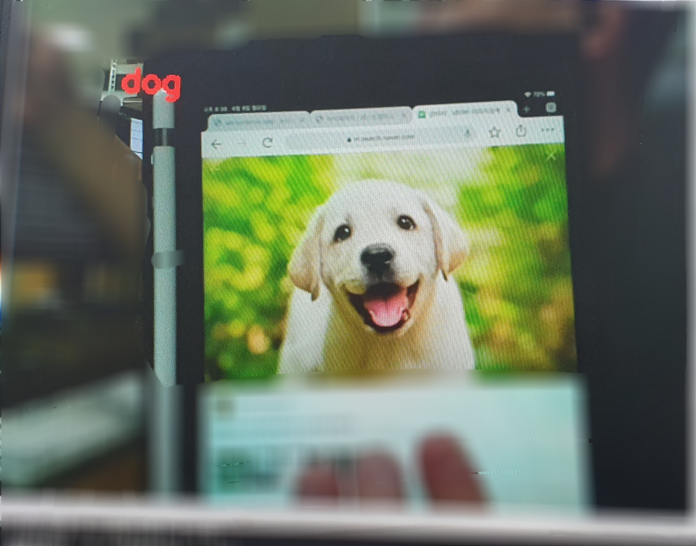
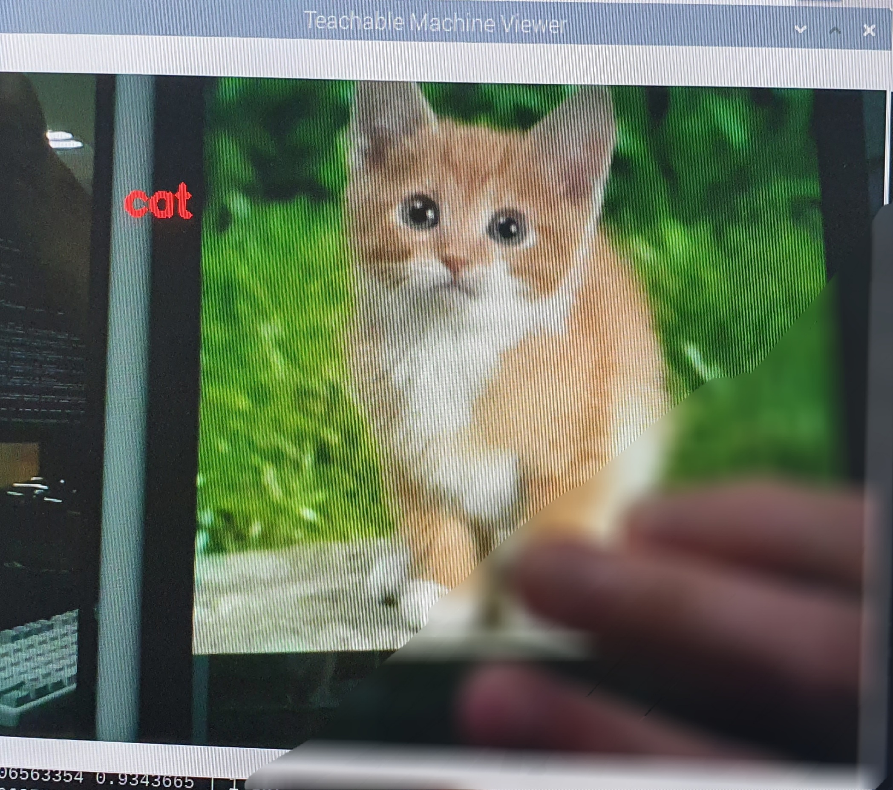

# Teachable machine(Image project) client
  + Client code(opencv) for teachable machine's Image project
  + https://teachablemachine.withgoogle.com/

# Execute
  + set Image project
  + Add a class
  + Training
  + Export Model (Tensorflow/Keras)
  + Run: python3 main.py --model [model_path] --labels [labels_path]

# demo

